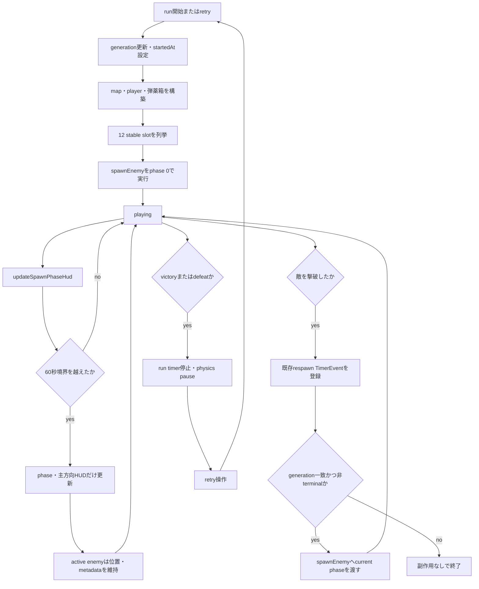
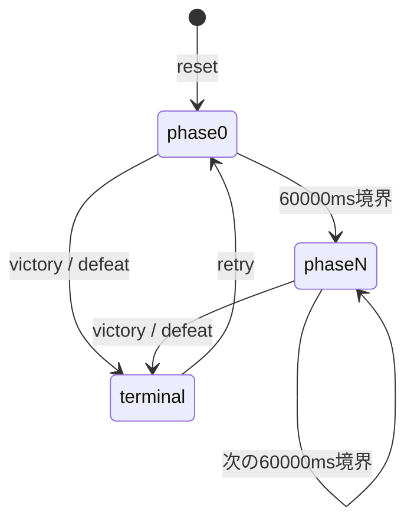

# directional-spawn-v1 詳細設計

## メタ情報

| 項目 | 内容 |
| --- | --- |
| 対象機能 | 60秒phaseによる4方向の敵spawn、stable 12 slot、主9・反3 |
| 対応する要件 | [REQ-DIRECTIONAL-SPAWN](../../20_requirements/directional-spawn-v1.md) |
| 対応する仕様 | [SPEC-DIRECTIONAL-SPAWN](../../30_specs/directional-spawn-v1.md) |
| 対応する基本設計 | [DESIGN-BASIC-DIRECTIONAL-SPAWN](../basic/directional-spawn-v1.md) |
| Definition of Delivery | [Issue #22 comment 5222574276](https://github.com/WFrog2511/2d-coop-survival/issues/22#issuecomment-5222574276) |
| ステータス | Implemented |
| 作成者 | Sol |
| 最終更新 | 2026-08-08 |
| 設計同期 | TypeScriptは手動同期。[Issue #31](https://github.com/WFrog2511/2d-coop-survival/issues/31)までtransform対象外 |

## 1. 目的

60秒ごとにmap seedから決定的に切り替わる主方向と反対方向を、敵の初期spawnおよびrespawnへ適用する実装判断を定める。phase境界でactive enemyを再配置せず、既存の戦闘・索敵・有限弾薬・3分生存・弾薬箱respawnを維持しながら、位置取りの判断を加える。

本書は純粋関数、Phaser Scene、DOM HUD、DEV限定hook、失敗時復元、unit/E2Eが共有する期待値を固定する。

## 2. 対象範囲

### 対象

| 項目 | 内容 |
| --- | --- |
| 対象ユースケース | run開始時の12体spawn、60秒phase表示、敵撃破後respawn、retry |
| 対象ロール | ローカル1人用プロトタイプのplayer、E2Eを実行する開発者 |
| 対象画面/API | Phaser arena、診断HUD、TypeScript純粋関数、DEV限定`debugRespawnEnemy` |
| 対象データ | map seed、run開始時刻、phase、stable slot、spawn方向、enemy metadata |

### 対象外

| 項目 | 理由 |
| --- | --- |
| wave director、敵数の動的増減 | 固定12体のPrototype standardを超えるため |
| phaseごとのHP・速度・damage・respawn delay変更 | Issue #22はspawn方向だけを対象とするため |
| 汎用spawn strategy、可変比率設定 | 一つの固定規則に対する将来用抽象化となるため |
| multiplayer sync、server authority、persistence | ローカルrun内だけの状態であるため |
| production向けdebug API | DEV E2E専用hookであり利用者向け契約ではないため |
| 新規依存、外部asset | 既存TypeScript、Phaser、DOMで実現できるため |
| TypeScript DOCGEN transform | [Issue #31](https://github.com/WFrog2511/2d-coop-survival/issues/31)へ延期されているため |

## 3. 関連ドキュメント

| 種別 | リンク |
| --- | --- |
| 要件定義 | [REQ-DIRECTIONAL-SPAWN](../../20_requirements/directional-spawn-v1.md) |
| 仕様 | [SPEC-DIRECTIONAL-SPAWN](../../30_specs/directional-spawn-v1.md) |
| 基本設計 | [DESIGN-BASIC-DIRECTIONAL-SPAWN](../basic/directional-spawn-v1.md) |
| Definition of Delivery | [Issue #22 comment 5222574276](https://github.com/WFrog2511/2d-coop-survival/issues/22#issuecomment-5222574276) |
| TypeScript DOCGEN follow-up | [Issue #31](https://github.com/WFrog2511/2d-coop-survival/issues/31) |

## 4. 業務ルール

| ルールID | ルール | 根拠 | 未決事項 |
| --- | --- | --- | --- |
| BR-DSP-001 | phaseは`floor(max(0, now - startedAt) / 60000)`とし、run開始時はphase 0とする | Issue #22 DOD | なし |
| BR-DSP-002 | 主方向は`up`、`right`、`down`、`left`をmap seedとphaseで決定的に循環させる | Issue #22 DOD | なし |
| BR-DSP-003 | spawn方向はspawn時点のplayer tileを基準に判定する | Issue #22 DOD | なし |
| BR-DSP-004 | stable slotは`index % 4 === 3`だけ反対方向、それ以外は主方向とし、12 slotで主9・反3とする | Issue #22 DOD | なし |
| BR-DSP-005 | stable IDは`basic-1`〜`basic-9`、`drone-1`〜`drone-3`の12個とする | Issue #22 DOD | なし |
| BR-DSP-006 | phase境界ではactive enemyを再配置せず、次のspawnまたはrespawnだけにcurrent phaseを適用する | Issue #22 DOD | なし |
| BR-DSP-007 | retryは旧generationを無効化し、新runを新map seed、phase 0、敵12体で開始する | Issue #22 DOD | なし |

## 5. 利用者導線・処理フロー



| ステップ | 操作者 | 入力 | システム処理 | 出力 |
| ---: | --- | --- | --- | --- |
| 1 | system | map seed、`startedAt` | phase 0と主方向を決め、12 slotをspawn | 敵12体、phase HUD |
| 2 | player | 移動・戦闘 | active enemyを既存AIで更新 | 既存戦闘表示 |
| 3 | system | `now` | 60秒境界でphaseと主方向HUDだけ更新 | 次回spawn用phase |
| 4 | system | 敵撃破、respawn timer | generationとterminalを検査し`spawnEnemy`を再利用 | current phaseのrespawn |
| 5 | player | retry | 旧generationを破棄し新runを初期化 | phase 0、新map、敵12体 |

## 6. 状態遷移



| 状態 | 意味 | 遷移条件 |
| --- | --- | --- |
| phase 0 | run開始から59999msまで。初期spawnのphase | reset完了 |
| phase N | 0始まりのcurrent phase。HUDと新規spawn入力だけが変わる | `now >= startedAt + N * 60000` |
| terminal | victoryまたはdefeat。spawn/respawn停止 | 180000ms到達またはplayer HP 0 |

phase遷移はactive enemyの再配置イベントではない。既にactiveなenemyはspawn時のphase、主方向、割り当て方向、tileを保持する。

## 7. データ設計

### 7.1 手書き設計方針

| データ | 型・値 | 設計方針 |
| --- | --- | --- |
| `SpawnDirection` | `'up' \| 'right' \| 'down' \| 'left'` | 順序を固定し、主方向の循環と反対方向計算へ共用する |
| `phase` | 0以上の整数 | `startedAt`と`now`から都度算出し、永続化しない |
| `stableSlot` | 0〜11の整数 | stable enemy ID配列のindexとし、run中に並び替えない |
| `ENEMY_INSTANCE_IDS` | basic 9 ID、drone 3 ID | CombatState、sprite、HUD、slot割り当ての共通identityとする |
| `SpawnRequest.direction` | optional `SpawnDirection` | 未指定時は既存offscreen selectorとして動作する |
| enemy sprite metadata | stable ID、spawn phase、primary/assigned direction、spawn tile | 成功したspawn時点の値を保持し、phase境界では更新しない |

### 7.2 enemy metadata dataset

| DOM属性 | 値 | 更新契機 |
| --- | --- | --- |
| `data-stable-id` | enemy stable ID | spawn成功後のHUD同期 |
| `data-spawn-phase` | spawn時の0始まりphase | spawn成功後のHUD同期 |
| `data-primary-direction` | spawn時の主方向 | spawn成功後のHUD同期 |
| `data-assigned-direction` | stable slotへ割り当てた主方向または反対方向 | spawn成功後のHUD同期 |
| `data-spawn-tile` | `x,y` | spawn成功後のHUD同期 |

`data-testid="spawn-phase"`は表示値`phase + 1`と`data-phase`を持つ。`data-testid="primary-direction"`は日本語表示と`data-direction`を持つ。既存HP値とvisibility datasetは同じenemy outputで維持する。

### 7.3 TypeScript手動同期

本機能のsourceはTypeScriptであるため、自動生成予約および自動生成blockを置かない。type、定数、関数signature、Scene private method、datasetは実装diffと本書を手動reviewして同期する。TypeScript public情報transformは[Issue #31](https://github.com/WFrog2511/2d-coop-survival/issues/31)まで対象外とし、このsliceでは追加しない。

## 8. サービス・API設計

| サービス/API | 種別 | 入力 | 出力 | 責務・主なエラー |
| --- | --- | --- | --- | --- |
| `spawnPhaseAt(startedAt, now)` | pure function | Scene時刻2値 | 0以上のphase | 負の経過時間を0へclampし、60000msで除算してfloorする |
| `primarySpawnDirection(seed, phase)` | pure function | map seed、phase | `SpawnDirection` | unsigned seedと0以上の整数phaseから4方向を決定的に循環させる |
| `spawnDirectionForSlot(primary, stableSlot)` | pure function | 主方向、slot index | `SpawnDirection` | `index % 4 === 3`だけ反対方向を返す |
| `selectSpawnTile(map, request, seed)` | pure selector | map、player、viewport、occupied、optional direction、seed | `TilePosition \| null` | 到達可能・非重複candidateから方向付きoffscreenを選び、fallbackする |
| `Arena.spawnEnemy(id)` | Scene private method | stable enemy ID | `boolean` | current phase、slot方向、occupiedを組み立て、spriteとmetadataを更新する。候補なしは`false` |
| `debugRespawnEnemy(id)` | DEV限定Scene public method | stable enemy ID | `void` | E2E用に既存`spawnEnemy`を再利用する。拒否条件または復元後の失敗は例外 |

外部HTTP API、永続化API、利用者向けJavaScript APIは追加しない。

## 9. candidate選択とfallback

`selectSpawnTile`は次の順序を変更しない。

1. map内floorから、playerへ到達可能かつ`occupied`に含まれないcandidateを作る。
2. candidateから現在のcamera viewport外にある`outside`を作る。
3. requested directionがある場合、`outside`からplayer基準方向が一致する`directed`を作る。
4. `directed`が1件以上なら方向付きpool、0件なら方向を問わない既存`outside` poolへfallbackする。
5. 選択したpoolからviewport gapが6 tile以下の`nearby`を作る。
6. `nearby`が1件以上ならそれを使い、0件なら手順4のpoolを使う。
7. poolの既存順序を保ち、`(seed >>> 0) % pool.length`のindexを選ぶ。
8. `outside`が0件なら、全candidateをplayerからのManhattan距離が遠い順、同距離では`y`、`x`の昇順に並べ、先頭の最遠floorへfallbackする。
9. candidateが0件なら`null`を返す。

player基準方向は`dx = target.x - player.x`、`dy = target.y - player.y`で求める。`abs(dx) > abs(dy)`なら`dx`の符号で左右、それ以外は`dy`の符号で上下を選ぶ。同率は上下を優先する。

enemy spawnの`occupied`にはspawn時点のplayer、activeな弾薬箱、対象以外のactive enemyを含める。初期spawnも先にspawnしたenemyを除外するため、12体を同じtileへ配置しない。

## 10. reset、update、spawn、respawn、terminal

### reset

1. generationを増やす。
2. survival、enemy respawn、flash、ammo box respawn、reloadのTimerEventを停止・clearする。
3. physicsをresumeし、CombatState、`startedAt`、respawn count、path、visibility cacheを初期化する。
4. 新map、player、visibility mask、camera、弾薬箱を構築する。
5. stable ID順に12回`spawnEnemy`を呼ぶ。いずれかが失敗したら初期化失敗とする。
6. survival timer、DEV公開、HUDを初期化する。

### update

毎frameの既存updateで`updateSpawnPhaseHud`を呼び、current phaseと主方向を表示する。HUD更新からenemyの再配置、metadata更新、respawn登録を行わない。

### spawn

`spawnEnemy`はplayer tile、current phase、map seed、stable slot、割り当て方向、occupiedを求めて`selectSpawnTile`を呼ぶ。成功時はspriteを有効化し、stable ID、phase、主方向、割り当て方向、tileをsprite dataへ設定し、path、visibility mask、enemy visibilityを更新する。

### respawn

敵撃破時はspriteを無効化してrespawn countを増やし、既存種別値のdelayでTimerEventを登録する。callbackはgeneration一致かつ非terminalの場合だけ`spawnEnemy`を呼び、成功後にCombatStateをrespawn済みへ更新する。

### terminal

victoryまたはdefeatでrun timerを停止し、player/enemy velocityを0、弾を無効化、physicsをpauseする。terminal後のrespawn callbackは実行しない。retryはresetへ戻りphase 0から新runを開始する。

## 11. バリデーション・エラーと復元

| 条件 | 表示・返却 | 回復導線 |
| --- | --- | --- |
| `selectSpawnTile`のcandidateが0件 | `null` | 呼び出し側がenemyを生成しない |
| 初期spawn失敗 | 例外「マップ上に敵の出現位置を確保できません」 | run初期化を成功扱いにしない |
| 通常respawn失敗 | `spawnEnemy=false`、HUDへ再出現位置なし | enemyをinactive/hidden、CombatStateをdefeatedのまま維持 |
| 旧generation callback | 副作用なし | current runを継続 |
| terminal中callback | 副作用なし | retryまでterminalを維持 |
| DEVで未知のID | 例外 | テストデータを修正 |
| DEVでinactiveまたはterminal | 例外 | 有効なplaying状態で再実行 |
| DEV再出現のcandidateなし | respawn count、元位置、spawn metadata、body、visibilityを復元後に例外 | 復元したplaying状態を維持 |

失敗時にplayer、弾薬箱、他enemyと重複する位置へ強制spawnしない。通常respawn失敗時はCombatStateだけを復活させず、spriteとstateの不一致を避ける。

## 12. DEV/production境界と非機能要件

### DEV/production境界

`debugRespawnEnemy`はDEV環境だけで呼出し可能とし、`window.__arenaScene`もDEV環境だけで公開する。production buildではScene、enemy操作、debug hookをglobalへ公開しない。hookはE2Eでcurrent phaseの通常`spawnEnemy`統合を観測するためだけに使う。

### 権限・監査

| 操作 | 許可境界 | 拒否条件 | 監査ログ |
| --- | --- | --- | --- |
| 通常spawn/respawn | Phaser Scene内部 | terminal、旧generation、候補なし | 永続監査ログなし。HUDで現在状態を観測 |
| `debugRespawnEnemy` | DEV環境のE2E | production、未知ID、inactive、terminal | 永続監査ログなし。例外とdatasetで検証 |

秘密情報、認証情報、個人情報は扱わない。

### 非機能要件

| 観点 | 方針 |
| --- | --- |
| 性能 | phase計算とHUD更新は定数時間。候補探索はspawn/respawn時だけ行い、phase境界で12体を再探索・再配置しない |
| 可用性 | 旧generationとterminal guardで遅延callbackの副作用を防ぎ、candidate不足時は重複生成より非生成を優先する |
| セキュリティ | productionでDEV hookとSceneをglobal公開しない。外部入力、通信、永続化を追加しない |
| アクセシビリティ | phaseと主方向を色だけでなく日本語テキストとDOM outputで表示し、敵HPとspawn metadataを既存の構造化HUDへ保持する |
| 運用 | map seed、phase、方向、stable ID、spawn tileをdata属性から再現・診断可能にする |

## 13. テスト観点

| レベル | 観点 | 期待結果 |
| --- | --- | --- |
| unit | phase直前・境界・複数phase | 59999msはphase 0、60000msはphase 1、同じ入力は同じ結果 |
| unit | 主方向循環 | 同じseedとphaseは同じ方向、連続4 phaseで4方向を一巡 |
| unit | stable slot | 12 slotで主方向9、反対方向3、`index % 4 === 3`だけ反対 |
| unit | 方向判定 | 左右優先条件と同率時の上下優先が仕様どおり |
| unit | candidate/fallback | reachable、unoccupied、offscreen、direction、gap、seed indexの順。方向なし、offscreenなし、candidateなしを検証 |
| unit | 12体初期spawn | player、弾薬箱、他enemyと非重複で、全tileが到達可能 |
| integration/E2E | phase境界 | HUDはphase 1へ変わるがactive 12体の位置とspawn metadataは不変 |
| integration/E2E | DEV respawn | 1体だけが既存`spawnEnemy`経由でcurrent phase、方向、新tileを取得し、他11体は不変 |
| E2E | retry | phase 0、新map seedの主方向、敵12体、旧generation副作用なし |
| 既存回帰 | Issue #20 | visibility、boundary silhouette、hidden、暗転maskを維持 |
| 既存回帰 | Issue #21 | 有限弾薬、射撃、武器切替、リロード、ammo panelを維持 |
| 既存回帰 | Issue #34 | 3分勝利、terminal停止、弾薬箱respawn、retryを維持 |

## 14. Gherkin受け入れ条件候補

```gherkin
Feature: 方向別enemy spawn

  Scenario: 60秒境界ではactive enemyを再配置しない
    Given phase 0で12体のenemyがactiveである
    And 各enemyのstable ID、spawn phase、方向、spawn tileを記録している
    When run開始から60000msの境界へ進む
    Then HUDのcurrent phaseはphase 1になる
    And 主方向はmap seedとphase 1に対応する方向になる
    And activeな12体の位置とspawn metadataは変わらない

  Scenario: phase境界後のrespawnだけがcurrent phaseを使う
    Given phase 1で12体のenemyがactiveである
    When DEV環境で1体をdebugRespawnEnemyにより再出現させる
    Then その1体はphase 1の主方向とstable slotの割り当て方向を持つ
    And その1体はplayer、弾薬箱、他enemyと重複しない到達可能tileにいる
    And 他の11体のspawn metadataは変わらない

  Scenario: retryはphase 0から新runを開始する
    Given phase 1以降またはterminal状態である
    When playerがretryする
    Then run generationが更新される
    And current phaseはphase 0になる
    And 新しいmap seedに対応する主方向と12体のenemyが初期化される
    And 旧generationのcallbackは新runへ副作用を与えない
```

## 15. 自動生成境界

本書には自動生成予定範囲および自動生成範囲を設けない。対象実装がTypeScriptであり、現行transformはPython sourceだけを対象とするためである。TypeScriptは実装diffと本書を手動同期し、`docgen.py --check`のPASSをTypeScript同期のPASSへ読み替えない。TypeScript transformは[Issue #31](https://github.com/WFrog2511/2d-coop-survival/issues/31)まで対象外とする。

## 16. 未決事項・人間確認

| ID | 確認事項 | 判断者 | 期限 | 影響 |
| --- | --- | --- | --- | --- |
| Q-DSP-001 | 主9・反3の方向圧力がスリルと位置取りの判断を生むか | 顧客またはプロジェクトオーナー。別`type:customer-review` Issueで確認 | 実装後レビュー時 | 技術PASSとは分離し、必要なら将来のbalance sliceを判断 |

## 17. 変更履歴

| 日付 | 変更内容 | 理由 | 変更者 |
| --- | --- | --- | --- |
| 2026-08-08 | 初版作成。実装済みdirectional spawn、DEV境界、検証観点を記録 | Issue #22 DODとTypeScript実装を手動同期 | Sol |
