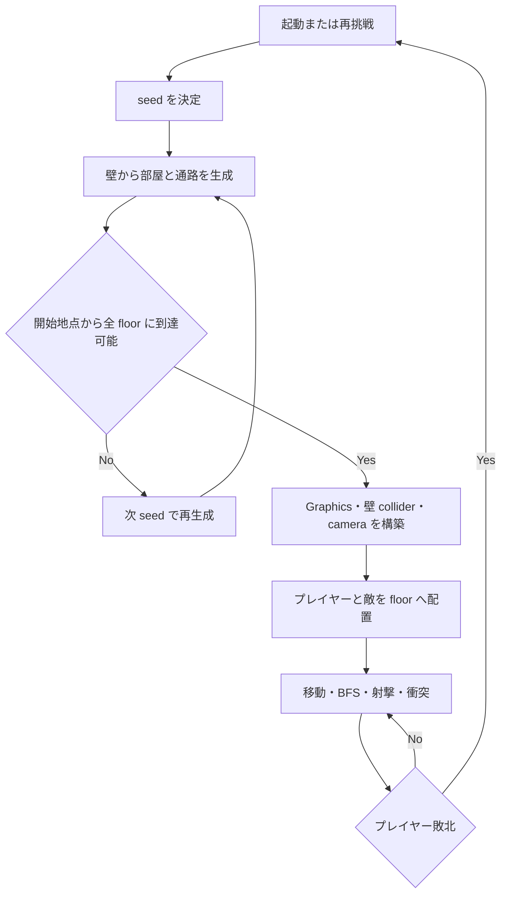
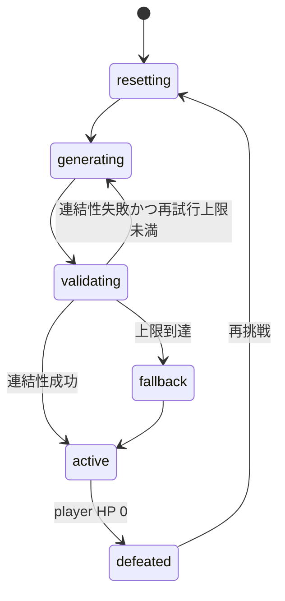

# 自動生成アリーナ v1 詳細設計

## 1. 目的

固定アリーナでは敵がプレイヤーへ直進するため、高速ドローンへの散弾の優位性と武器の立ち位置が十分に生まれない。この設計は、遮蔽物と狭い通路を持つ広域アリーナ、追従カメラ、地面グリッド、画面外からの敵出現を最小限に追加し、アサルトライフルを主武器、近距離のショットガンを副武器として選択できる状況を作る。

- 表示領域は既存の 800×500px のままとし、見た目と操作の入口を変えない。
- ワールドは 40px タイル、40×25 マス、1600×1000px とする。
- 生成、経路、出現候補、再出現待ち時間は 32bit seed により決定的にする。
- 新規依存、外部アセット、汎用マップ基盤を追加しない。

この文書は TypeScript 実装前の設計である。現行 DOCGEN は Python の公開コード要素だけを対象にしており、TypeScript transform は未対応のため、未対応の `DOCGEN_TODO` / `DOCGEN` ブロックは置かない。

## 2. 対象範囲

### 対象

| 項目 | 内容 |
|---|---|
| 生成地形 | 壁から開始し、開始部屋を含む矩形部屋と L 字通路を掘る。通路幅は 1〜3 タイルとする。 |
| 遮蔽物 | 外周と未掘削タイルを壁にし、部屋内には経路を塞がない少数の 1 タイル障害物を置く。 |
| カメラ | ワールド境界を設定し、プレイヤーを追従する。 |
| 見た目 | 床に 40px グリッド、壁に識別可能な Graphics を描画する。 |
| 敵移動 | 4 近傍 BFS の次タイルへ移動し、壁を通過しない。ドローンは経路方向の横移動を合成する。 |
| 出現 | 敵の初期出現・再出現は、重複しない floor を選び、可能なら camera viewport 外を優先する。 |
| 観測 | HUD に map seed とプレイヤーのタイル座標を表示する。 |

### 対象外

- 視界・霧、破壊可能地形、マップ保存・選択、外部画像・音源、通信同期
- A*、navmesh、汎用 pathfinding 基盤、ウェーブや難易度 director、高度な自動生成
- 敵種・武器種・ダメージ相性の追加

`ponytail: 部屋と順次 L 字通路だけの生成に留める。プレイで同じ経路が続く、または敵が経路上で詰まることが確認された時に、生成規則または経路探索の拡張を再検討する。`

## 3. 実装予定と責務

### 実装予定

| 項目 | 内容 |
|---|---|
| 実装ユースケース | ローカル Chrome 上で、遮蔽物のあるアリーナを移動・射撃し、敵と戦闘する。 |
| 実装ロール | `src/arena-map.ts` の純粋な生成・経路・出現選択と、`src/main.ts` の Phaser Scene 統合。 |
| 実装画面/API | 既存のゲーム Canvas と DOM HUD。外部 API は追加しない。 |
| 実装データ | タイル配列、seed、player/enemy のタイル位置、再出現の決定用状態。 |

### 実装対象

| 項目 | 役割 |
|---|---|
| `src/arena-map.ts` | 32bit PRNG、地形生成、到達可能性検査、BFS、spawn 候補と再出現待ち時間の純粋関数を提供する。 |
| `src/main.ts` | Graphics と物理壁を構築し、camera follow、衝突、enemy path の更新、HUD、リセットを統合する。 |
| `tests/arena-map.test.ts` | seed、連結性、通路幅、BFS、spawn、待ち時間の契約を検査する。 |
| `e2e/prototype.spec.ts` | map HUD、移動、再挑戦、既存の戦闘ループを代表経路として検査する。 |

## 4. 業務ルール

| ルールID | ルール | 根拠 | 未実装理由 |
|---|---|---|---|
| BR-ARENA-001 | 表示領域は 800×500px、ワールドは 40×25 タイル、1 タイルは 40px とする。 | プレイヤーの操作感を維持しつつ探索範囲を作る。 | なし |
| BR-ARENA-002 | 同一 seed は同一の地形、spawn 選択、再出現待ち時間を返す。 | 不具合再現とテストを可能にする。 | なし |
| BR-ARENA-003 | 外周は常に wall、全 floor は開始地点から到達可能である。 | 壁抜けと孤立部屋を防ぐ。 | なし |
| BR-ARENA-004 | 通路は 1〜3 タイル幅の L 字で部屋中心を順に接続する。通常部屋は 7、幅 5〜9、高さ 4〜7 タイルとする。 | 狭所と広所の最小の組合せを作る。 | なし |
| BR-ARENA-005 | 初期・再出現は他個体と重ならず、viewport 外の floor を優先する。 | 固定位置・固定時刻の出現を避ける。 | なし |
| BR-ARENA-006 | BFS は floor 上の 4 近傍だけを通過する。 | 40×25 の小規模ワールドに十分である。 | なし |
| BR-ARENA-007 | 再挑戦時は最大64候補から直前とtile配置が異なるmapを選び、古いtimerと経路が新マップへ影響しない。 | 同じ地形への固定化と状態漏れを防ぐ。 | なし |
| BR-ARENA-008 | [Issue #38](https://github.com/WFrog2511/2d-coop-survival/issues/38) follow-upにより、death再出現待ちはbasic 5000〜9000ms、drone 3000〜6000ms（両端含む）で決定的に決める。 | 撃破後の圧力を遅延させつつ再現可能にする。 | なし |

## 5. 処理フロー



| ステップ | 処理 | 入力 | システム状態 | 出力 |
|---:|---|---|---|---|
| 1 | seed を初期化または更新する。 | 前回 seed、再挑戦回数 | `resetting` | 32bit seed |
| 2 | wall の格子から開始部屋と複数部屋を掘る。 | seed | `generating` | 部屋一覧、タイル配列 |
| 3 | 部屋中心を順に幅 1〜3 の L 字通路で接続し、少数障害物を置く。 | 部屋一覧、PRNG | `generating` | 候補地形 |
| 4 | BFS で開始 floor から全 floor を検査する。 | 候補地形 | `validating` | 有効地形または失敗 |
| 5 | 有効地形を描画し、壁物理と camera bounds を作る。 | 地形 | `active` | 追従可能な Scene |
| 6 | 敵ごとに spawn floor と待ち時間を選び、約 250ms ごとまたは player tile 変化時に BFS を更新する。 | 地形、位置、seed | `active` | enemy 次タイル |

## 6. 状態遷移



| 状態 | 入口条件 | 許可遷移 |
|---|---|---|
| `resetting` | 起動または再挑戦 | `generating` |
| `generating` | seed が利用可能 | `validating` |
| `validating` | 地形候補がある | `generating`、`fallback`、`active` |
| `fallback` | 8 回の連続生成が失敗 | `active` |
| `active` | 地形、壁、プレイヤー、敵が構築済み | `defeated` |
| `defeated` | player HP が 0 | `resetting` |

通常生成では 7 部屋（幅 5〜9、高さ 4〜7）を置く。各部屋は外周と他部屋から最低 1 タイルの wall 余白を保ち、候補配置は部屋ごとに最大 40 回試す。生成全体は最大 8 回まで次 seed を試す。上限到達時は、開始部屋と同じ生成規則で必ず連結する最小の 4 部屋・幅 2 通路の fallback 地形を返す。fallback は seed を HUD に表示し、無限再試行をしない。

## 7. データ設計

### 手書き設計情報

| データ | 内容 |
|---|---|
| `ArenaMap` | `width`、`height`、`tileSize`、`seed`、wall/floor タイル、開始 tile、部屋と通路のメタ情報を持つ。 |
| `TilePosition` | 整数の `x`、`y`。ワールド座標はタイル中央へ変換する。 |
| `SeededRandom` | 32bit seed を内部状態とし、次の整数と範囲値を決定的に返す。 |
| `SpawnRequest` | player tile、camera viewport の tile 範囲、既に占有した tile を持つ。 |
| `EnemyPathState` | 現在の path、次の再探索時刻、前回 player tile を持つ Scene 内部状態。 |

### 生成契約

1. 外周を除く全タイルは初期値 `wall` とする。
2. 最初の矩形部屋は十分な余白を残して作り、その中心を player 開始 tile とする。
3. 追加の矩形部屋を seed に従って作り、前の部屋中心との横・縦の順序を seed で選ぶ L 字通路で接続する。
4. 部屋内障害物は、開始 tile、部屋中心、通路のいずれも wall にしない候補だけに置く。
5. 到達可能性検査で失敗した候補は返さない。

## 8. Scene 統合設計

### Graphics と物理

- ground grid は Phaser `Graphics` で全ワールドに 40px 間隔で描く。
- wall は別の `Graphics` で描き、static physics group に登録する。横連続する wall を矩形 run にまとめてもよいが、当初は 1 タイルずつ登録して正しさを優先する。
- player と enemy は wall group と collider を持つ。bullet と wall の collider は、弾を即座に無効化する。
- camera bounds は `(0, 0, 1600, 1000)`、`startFollow(player)` を設定する。

### 敵の経路と移動

- Scene は player の現在 tile が変わったとき、または各 enemy の前回探索から 250ms 経過したときに `findPath` を呼ぶ。
- path が存在するときは次 tile の中心へ向かう。path がないときは速度を 0 とし、壁を通過する直進追跡へ戻さない。
- basic enemy は経路方向へ既存速度で進む。drone は同じ経路方向に、既存の決定的横速度を加える。
- Phaser wall collider が最終的な侵入防止を担うため、横速度で角に当たった drone も壁を抜けない。

### spawn と再出現

- enemy の spawn 候補は floor かつ未占有の tile とする。
- player の viewport に交差しない候補を優先し、候補の中から seed 付き乱数で選ぶ。
- viewport 外候補がないときは、player からの Manhattan 距離が最大の floor を座標順で決定的に選ぶ。
- death再出現待ちはIssue #38によりbasic 5000〜9000ms、drone 3000〜6000ms（両端含む）とする。同じseed・敵個体・出現回数で同じ値になる。

### リセットと失敗時動作

再挑戦では、再出現・命中表示・reload・path 更新の timer を解除し、弾を無効化し、旧 wall bodies と二つの Graphics を破棄する。その後に新 seed の `ArenaMap`、物理壁、player/enemy 配置、HUD を構築する。timer callback は世代番号を保持し、現在の map 世代と異なる callback は状態を書き換えない。

地形生成に失敗しても fallback 地形で `active` へ進める。spawn 候補が不足しても重複を許さず、最遠 floor fallback を用いる。HUD 要素を取得できない既存の起動失敗条件は維持する。

## 9. API 設計

| API | メソッド | 入力 | 出力 | 主なエラー |
|---|---|---|---|---|
| `generateArenaMap` | pure function | seed | 連結済み `ArenaMap` | 生成失敗時も fallback を返す |
| generateNextArenaMap | pure function | 直前の ArenaMap | 直前とtile配置が異なる ArenaMap | 64候補で差がなければ明示的に失敗 |
| `findPath` | pure function | `ArenaMap`、開始 tile、目標 tile | floor の 4 近傍 path または空配列 | wall または範囲外の開始・目標は空配列 |
| `selectSpawnTile` | pure function | `ArenaMap`、`SpawnRequest`、seed 状態 | 未占有 floor または `null` | floor 不足時は `null` |
| `respawnDelayFor` | pure function | enemy ID、出現回数、seed | 範囲内の遅延 ms | 未知 enemy ID は実装時に fail-fast |

## 10. バリデーション・エラー

| 条件 | エラーコード | 表示/処理 | 回復方法 |
|---|---|---|---|
| 連結性検査失敗 | `arena-generation-invalid` | 次 seed で再生成 | 最大 8 回後に fallback |
| spawn floor 不足 | `arena-spawn-unavailable` | enemy を active にしない | 次の再出現または map reset |
| path なし | `arena-path-unavailable` | 当該 enemy を停止 | 次回 path 更新 |
| 古い timer callback | `arena-stale-generation` | 処理しない | 現 map 世代を維持 |

## 11. ライブラリ・依存関係

| ライブラリ | 利用箇所 | 採用理由 | ライセンスログ |
|---|---|---|---|
| TypeScript 標準機能 | PRNG、BFS、配列操作 | 追加依存なしで小規模グリッドを扱える。 | 既存依存 |
| Phaser | Graphics、Arcade Physics、Camera | 既存ゲーム実行基盤をそのまま使う。 | 既存依存 |

## 12. 性能・非機能

| 観点 | 方針 |
|---|---|
| 性能 | 40×25=1000 タイル、enemy 4 体、250ms 間隔の BFS に限定する。 |
| 可用性 | 生成失敗は無限再試行せず、8 回で fallback に切り替える。 |
| セキュリティ | 外部入力・通信・永続化を追加しない。 |
| 運用 | HUD seed とタイル座標を不具合報告・E2E の観測点にする。 |
| アクセシビリティ | 既存キーボード操作と DOM HUD を維持し、Canvas の色だけに状態を依存させない。 |

## 13. テスト観点

| レベル | 観点 | 期待結果 |
|---|---|---|
| Unit | 同一 seed | 同じ tile 配列、開始 tile、spawn 候補、再出現待ち時間になる。 |
| Unit | 外周と連結性 | 外周は wall、全 floor は開始 tile から到達可能である。 |
| Unit | 通路幅 | 各接続で 1〜3 タイル幅の通路メタ情報を残し、その幅で floor が掘られる。 |
| Unit | BFS | 4 近傍のみを通る最短経路、wall・範囲外時の空配列を返す。 |
| Unit | spawn | viewport 外・未占有 floor を優先し、候補不足時は最遠 floor fallback へ進む。 |
| Unit | respawn delay | 敵種別の許容範囲内で、seed と出現回数に対して決定的である。 |
| Unit | retry | 最大64候補内でseedとtile配置が直前mapから変わる。 |
| E2E | HUD | map seed と player tile 座標が初期表示される。 |
| E2E | 移動と camera | 操作後に player tile 座標が変わり、Canvas はページエラーなしで維持される。 |
| E2E | 再挑戦 | 敗北後の再挑戦で map seed が変わり、戦闘状態も既存仕様どおり初期化される。 |
| E2E | 戦闘回帰 | ライフル自動射撃、ショットガン待ち時間、リロード、敵撃破を維持する。 |

## 14. Gherkin 受け入れ条件

```gherkin
Feature: 遮蔽物のある自動生成アリーナ
  Scenario: プレイヤーが地形と座標を確認して移動する
    Given 40x25 タイルのアリーナが生成されている
    And HUD に map seed と player tile 座標が表示されている
    When プレイヤーが通路を通って移動する
    Then タイル座標が変化し、wall を通過しない

  Scenario: 敗北後に別のアリーナで再挑戦する
    Given 現在の map seed が HUD に表示されている
    When プレイヤーが敗北して再挑戦する
    Then 新しい map seed が表示される
    And 武器、弾倉、敵、弾、timer は初期状態になる
```

## 15. 未確定事項・人間確認

| ID | 確認事項 | 反映先 | 期限 | 相談先 |
|---|---|---|---|---|
| Q-ARENA-001 | 狭い遮蔽物地形で、ショットガンを近距離の副武器として使い分けられるか。関連するドローン撃破優先度は [GitHub Issue #15](https://github.com/WFrog2511/2d-coop-survival/issues/15) で確認する。 | [GitHub Issue #17](https://github.com/WFrog2511/2d-coop-survival/issues/17) | 実装後 | プロジェクトオーナー |

## 16. 変更履歴

| 日付 | 変更内容 | 理由 | 変更者 |
|---|---|---|---|
| 2026-08-02 | 初版作成 | ドローンと武器の使い分けを成立させるため、生成地形・追従カメラ・グリッドを設計した。 | Terra |
| 2026-08-02 | 実装同期 | 純粋生成・BFS・spawnとPhaser統合、再挑戦map差の検証結果を反映した。 | Sol review / Terra implementation |
| 2026-08-08 | Issue #38同期 | death再出現delayを5000〜9000ms/3000〜6000msへ更新した。 | Sol |
