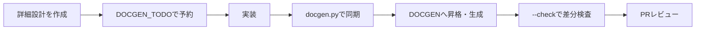

# 詳細設計DOCGENガイド

DOCGENは、詳細設計書のうちコードから機械的に復元できる事実だけを同期する仕組みです。設計意図の正本は手書き部分に残します。



## 責務境界

| 区分 | 内容 | 編集方法 |
| --- | --- | --- |
| 手書き | 設計意図、業務ルール、状態遷移、認可、異常時動作、テスト観点 | 人間とエージェントが編集 |
| `DOCGEN_TODO` | 実装前の生成予定範囲 | source・transform・targetを設計時に予約 |
| `DOCGEN` | コードから復元したフィールド、publicメンバー、APIルートなど | `docgen.py`だけが更新 |

## マーカー

実装前はTODOとして予約します。対象がまだ存在しない場合は警告を出して内容を維持します。対象が解決できるようになると、同期時に通常のDOCGENブロックへ昇格します。

```md
<!-- DOCGEN_TODO:START id=service-members source=src/app/service.py transform=python_class_members target=AppService include_private=false -->
実装後にpublicメンバー一覧を生成する。
<!-- DOCGEN_TODO:END -->
```

実装後の生成範囲は手編集しません。

```md
<!-- DOCGEN:START id=service-members source=src/app/service.py transform=python_class_members target=AppService include_private=false -->
<!-- DOCGEN:END -->
```

| 属性 | 必須 | 内容 |
| --- | --- | --- |
| `source` | はい | リポジトリルートからのPythonファイル |
| `transform` | はい | 使用する変換名 |
| `target` | はい | クラス名、関数名、または `*` |
| `id` | いいえ | 文書内で識別しやすい安定名 |
| `include_private` | いいえ | privateメンバーを含めるか |
| `include_docstring` | いいえ | docstring由来の説明を含めるか |

## 対応transform

| transform | 出力 |
| --- | --- |
| `python_dataclass_fields` | 型注釈付きフィールド一覧 |
| `python_class_members` | クラスのメンバー一覧 |
| `python_class_source` | 対象クラスのソース抜粋 |
| `python_api_routes` | FastAPI `APIRouter` のルート一覧 |

## 実行

リポジトリルートから実行します。

```powershell
python scripts/docgen.py "docs/40_design/detail/**/*.md"
python scripts/docgen.py --check "docs/40_design/detail/**/*.md"
```

同期コマンドは生成ブロックを更新します。`--check` はファイルを書き換えず、更新が必要なら終了コード1を返します。source不在、未知のtransform、target不在、Python構文エラー、対応しないSTART/ENDも失敗として報告します。

新しいtransformを追加する場合は、`scripts/docgen_lib/transforms/`へ実装し、登録表とpytestを同じ変更で更新します。
