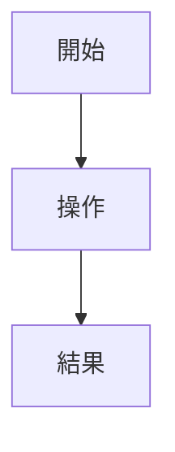
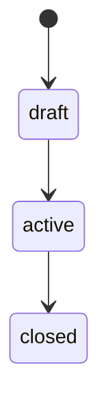

# 詳細設計書テンプレート

## メタ情報

| 項目 | 内容 |
|---|---|
| 対象機能 | TODO: 機能名 |
| 対応する基本設計 | TODO: 基本設計ページへのリンク |
| 対応する要件 | TODO: 要件IDまたは要件ページ |
| 関連ADR | TODO: ADRリンク |
| ステータス | Draft |
| 作成者 | TODO |
| 最終更新 | TODO: YYYY-MM-DD |

## 1. 目的

この詳細設計書で決めることを書く。

- TODO: この機能が満たす利用者価値
- TODO: 実装コード・テストコードが参照すべき設計判断
- TODO: 基本設計から詳細化した範囲

## 2. 対象範囲

### 対象

| 項目 | 内容 |
|---|---|
| 対象ユースケース | TODO |
| 対象ロール | TODO |
| 対象画面/API | TODO |
| 対象データ | TODO |

### 対象外

| 項目 | 理由 |
|---|---|
| TODO | TODO |

## 3. 関連ドキュメント

| 種別 | リンク |
|---|---|
| 要件定義 | TODO |
| 基本設計 | TODO |
| ADR | TODO |
| Gherkin | TODO |
| 議論ログ | TODO |

## 4. 業務ルール

| ルールID | ルール | 根拠 | 未決事項 |
|---|---|---|---|
| BR-001 | TODO | TODO | TODO |

## 5. 利用者導線・操作フロー



| ステップ | 操作者 | 入力 | システム処理 | 出力 |
|---:|---|---|---|---|
| 1 | TODO | TODO | TODO | TODO |

## 6. 状態遷移



| 状態 | 意味 | 遷移条件 |
|---|---|---|
| TODO | TODO | TODO |

## 7. データ設計

### 7.1 手書き設計方針

コードから生成できない設計意図、制約、保存期間、削除・匿名化方針を書く。

| データ | 設計方針 |
|---|---|
| TODO | TODO |

### 7.2 自動生成: データクラス・フィールド

実装前は `DOCGEN_TODO` のまま残す。実装後、`source`、`transform`、`target` を確定して `DOCGEN:START` / `DOCGEN:END` に切り替える。

<!-- DOCGEN_TODO:START id=data-fields source=src/path/to/module.py transform=python_dataclass_fields target=TargetDataClass -->
実装後にデータクラスのフィールド一覧を自動生成する。
<!-- DOCGEN_TODO:END -->

### 7.3 自動生成: クラス定義抜粋

必要な場合だけ使用する。長すぎるソース貼り付けは避け、設計確認に必要な範囲に限定する。

<!-- DOCGEN_TODO:START id=class-source source=src/path/to/module.py transform=python_class_source target=TargetClass -->
実装後に対象クラスのソース抜粋を自動生成する。
<!-- DOCGEN_TODO:END -->

## 8. サービス・ユースケース設計

### 8.1 手書き設計方針

| サービス/ユースケース | 責務 | 呼び出し元 | 依存先 |
|---|---|---|---|
| TODO | TODO | TODO | TODO |

### 8.2 自動生成: publicメンバー

<!-- DOCGEN_TODO:START id=service-members source=src/path/to/service.py transform=python_class_members target=TargetService include_private=false -->
実装後にサービスクラスのpublicメンバー一覧を自動生成する。
<!-- DOCGEN_TODO:END -->

## 9. API設計

| API | メソッド | 認可 | 入力 | 出力 | 主なエラー |
|---|---|---|---|---|---|
| TODO | TODO | TODO | TODO | TODO | TODO |

### 自動生成: API定義

FastAPIルート一覧をコードから同期する場合に使用する。実装前またはAPI境界が未確定の間は `DOCGEN_TODO` として残す。

<!-- DOCGEN_TODO:START id=api-routes source=src/path/to/api.py transform=python_api_routes target=* -->
実装後にAPIルート一覧を自動生成する。
<!-- DOCGEN_TODO:END -->

## 10. バリデーション・エラー

| 条件 | エラーコード | 表示/返却内容 | 回復導線 |
|---|---|---|---|
| TODO | TODO | TODO | TODO |

## 11. 権限・監査ログ

| 操作 | 許可ロール | 拒否条件 | 監査ログ | ログに残さない情報 |
|---|---|---|---|---|
| TODO | TODO | TODO | TODO | TODO |

## 12. 非機能要件

| 観点 | 方針 |
|---|---|
| 性能 | TODO |
| 可用性 | TODO |
| セキュリティ | TODO |
| 運用 | TODO |
| アクセシビリティ | TODO |

## 13. テスト観点

| レベル | 観点 | 期待結果 |
|---|---|---|
| 単体 | TODO | TODO |
| 統合 | TODO | TODO |
| E2E | TODO | TODO |

## 14. Gherkin受け入れ条件候補

```gherkin
Feature: TODO 機能名
  Scenario: TODO 代表的な成功ケース
    Given TODO 前提
    When TODO 操作
    Then TODO 結果
```

## 15. 自動生成ブロック一覧

この詳細設計書に置いた自動生成予定範囲を一覧化する。実装後、`docgen_sync_agent` が `DOCGEN_TODO` を `DOCGEN` に切り替える候補として使う。

| id | source | transform | target | 実装後の扱い |
|---|---|---|---|---|
| data-fields | `src/path/to/module.py` | `python_dataclass_fields` | `TargetDataClass` | 対象クラス確定後に有効化 |
| class-source | `src/path/to/module.py` | `python_class_source` | `TargetClass` | 必要な場合だけ有効化 |
| service-members | `src/path/to/service.py` | `python_class_members` | `TargetService` | サービス実装後に有効化 |
| api-routes | `src/path/to/api.py` | `python_api_routes` | `*` | API境界確定後に有効化 |

## 16. 未決事項・人間確認

| ID | 確認事項 | 判断者 | 期限 | 影響 |
|---|---|---|---|---|
| Q-001 | TODO | TODO | TODO | TODO |

## 17. 変更履歴

| 日付 | 変更内容 | 理由 | 変更者 |
|---|---|---|---|
| YYYY-MM-DD | 初版作成 | TODO | TODO |
